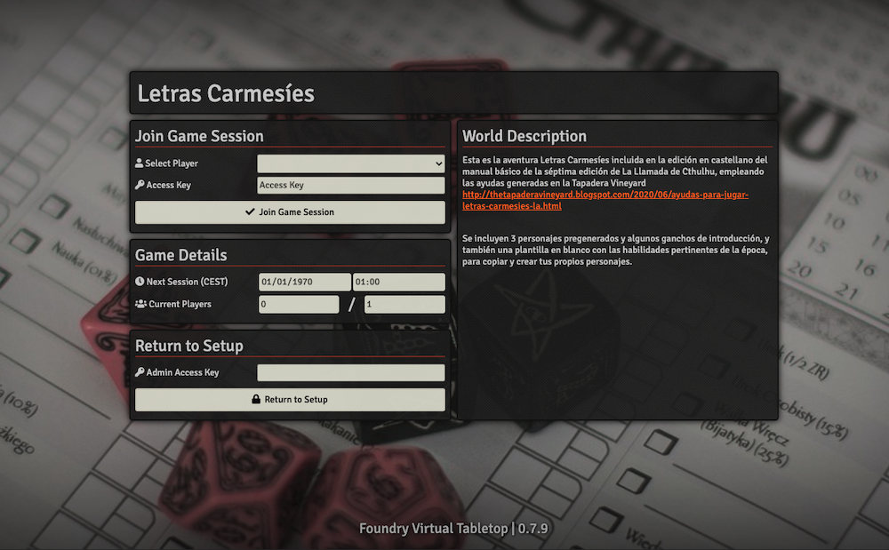
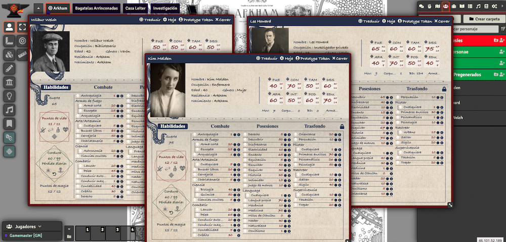
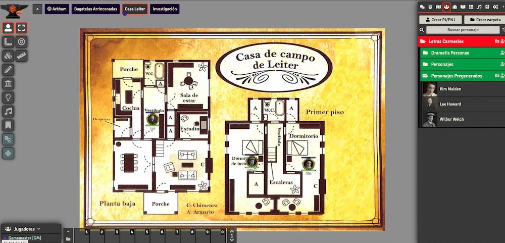

# foundryvtt-coc7-letrascarmesies

**Letras carmesíes** es una aventura de investigación incluida en el manual básico de la séptima edición de la Llamada de Cthulhu de Edge. Esta partida se ha preparado a partir del material generado por Ignacio Sánchez Aranda de The Tapadera Vineyard (más información en http://thetapaderavineyard.blogspot.com/2020/06/ayudas-para-jugar-letras-carmesies-la.html).

## Instalar
Para instalar la partida basta con usar la URL https://raw.githubusercontent.com/jorsermar/foundryvtt-coc7-letrascarmesies/master/world.json en el instalador de mundos (primera pantalla del aministrador de Foundry VTT) o descargar el zip https://github.com/jorsermar/foundryvtt-coc7-letrascarmesies/archive/refs/heads/master.zip y descomprimirlo en la ruta /worlds de nuestra instalación de Foundry VTT.

## Contenido
La aventura incluye:
- 4 escenas (un mapa de Arkham con las localizaciones más relevantes añadidas como marcadores, la Casa de Leiter, el Bagatelas Arrinconadas, y un tablero de corcho donde se podrán ir descubriendo los avances de la investigación y personajes relevantes, así como añadir notas de cosecha propia).
- 9 fichas de Personajes No Jugadores, los sospechosos del caso
- 2 fichas de monstruos
- 3 Personajes Pregenerados listos para jugar
- 1 ficha en blanco para copiar y crear tus propios Personajes Jugadores.
- Más de 20 Ayudas de Juego incluyendo fotos de los Personajes No Jugadores, una lista de las localizaciones más relevantes con informácion sobre las mismas, una cronología de los sucesos, ayudas para introducir a los Personajes Jugadores en la trama...

